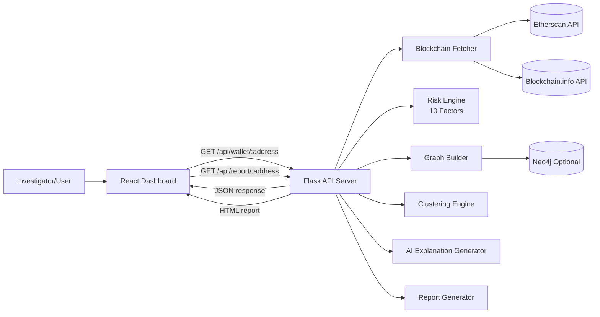
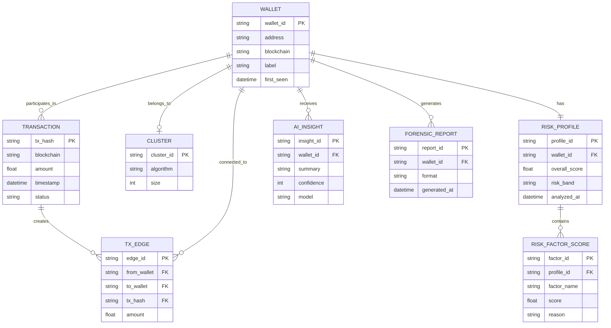
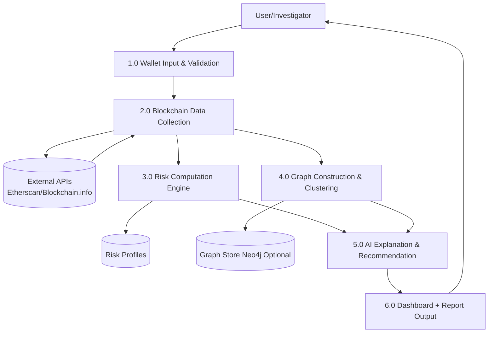
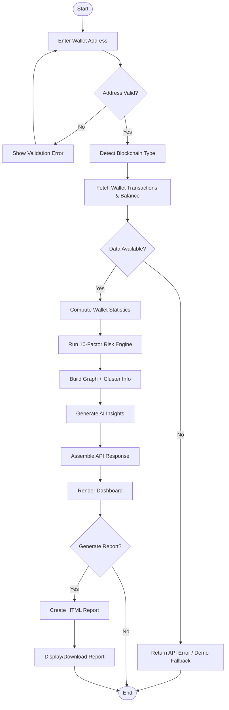

# AI-Assisted Blockchain Forensics System - Project Report

## 1. Abstract
The AI-Assisted Blockchain Forensics System is a full-stack investigative platform that analyzes Ethereum and Bitcoin wallet addresses, computes a composite forensic risk score, visualizes transaction relationships, and generates human-readable investigation insights. The system combines blockchain data ingestion, graph analytics, risk factor modeling, and AI-backed explanation generation in a single workflow exposed through a Flask API and React dashboard.

## 2. Problem Statement
Blockchain transactions are public but difficult to interpret at scale. Investigators need tooling that can:
- Ingest wallet data from multiple chains.
- Detect suspicious behavioral patterns.
- Explain risk signals in plain language.
- Visualize transaction connectivity for faster triage.

## 3. Objectives
- Build a unified wallet analysis pipeline for Ethereum and Bitcoin.
- Implement a modular 10-factor forensic risk engine.
- Provide graph-based relationship visualization.
- Generate investigation-friendly AI summaries and downloadable reports.
- Deliver a user-friendly dashboard for non-technical analysts.

## 4. Scope
### In Scope
- Wallet-level blockchain forensics.
- Risk scoring and risk banding (LOW/MEDIUM/HIGH/CRITICAL).
- Graph view of wallet interactions.
- HTML report generation.
- Optional local LLM enhancement through Ollama.

### Out of Scope
- Exchange-grade real-time streaming analytics.
- Legal attribution or identity certainty.
- Production-hardening for enterprise SLA workloads.

## 5. Technology Stack
- Frontend: React 18, Vite 6, CSS
- Backend: Python 3.10+, Flask, Flask-CORS
- Graph/Storage: Neo4j (optional, graceful fallback supported)
- APIs: Etherscan API, Blockchain.info API
- AI/ML: Rule-based NLP, optional Ollama (Gemma), scikit-learn clustering

## 6. System Architecture
The platform follows a modular pipeline:
1. Frontend collects wallet input and requests analysis.
2. Flask API orchestrates data fetch, risk scoring, graph extraction, AI explanation, and report generation.
3. Modules execute independently with fallbacks (for unavailable Neo4j or LLM).
4. Results are returned as structured JSON for dashboard rendering.

### Architecture Diagram (Mermaid)


## 7. Module-Wise Implementation
### 7.1 Blockchain Data Fetcher (Module A)
- Detects address type (Ethereum/Bitcoin).
- Fetches raw transaction and balance data.
- Normalizes chain-specific fields for downstream modules.

### 7.2 Graph Builder (Module B)
- Extracts connected wallets and transaction links.
- Uses Neo4j when available; falls back to in-memory graph assembly.

### 7.3 Clustering Engine (Module C)
- Supports heuristic and behavior-based grouping.
- Includes community-level analysis for related wallets.

### 7.4 Risk Scoring Engine (Module D)
- Computes weighted forensic score from 10 factors:
  - transaction_velocity
  - amount_anomaly
  - behavioral_pattern
  - connection_density
  - dormancy_risk
  - mixing_entropy
  - exposure_risk
  - chain_hopping
  - peeling_chain
  - round_number_risk
- Produces overall score, risk band, and factor explanations.

### 7.5 AI Explanation Generator (Module E)
- Converts technical findings into readable summaries.
- Produces recommendations and confidence signals.
- Uses rule-based explanation by default with optional Ollama enhancement.

### 7.6 Report Generator (Module G)
- Produces standalone HTML forensic report.
- Includes score summary, key statistics, and explanatory sections.

### 7.7 Integration Layer (Module H)
- Coordinates end-to-end analysis flow:
  fetch -> stats -> risk -> graph -> clustering -> AI -> response/report.

## 8. Database Design (ER Diagram)
Logical entities and relationships used by the analysis workflow are shown below.



## 9. Data Flow Diagram (Level-1)


## 10. Activity Flow Diagram


## 11. API Design Summary
- GET `/api/health` - system/module health
- GET `/api/wallet/<address>` - complete analysis payload
- GET `/api/report/<address>` - HTML forensic report

## 12. Frontend Workflow
- `WalletInput` triggers `analyzeWallet(address)`.
- Dashboard components render unified payload:
  - `StatsOverview`
  - `RiskAnalysis`
  - `TransactionGraph`
  - `GraphExplanation`
  - `TransactionList`
  - `AIInsights`
- If backend fails, app falls back to mock/demo data for UI continuity.

## 13. Testing and Validation
Current repository includes risk engine tests in:
- `backend/src/modules/risk/tests/test_wallet.py`

Validated points:
- Risk output structure.
- Risk band correctness.
- Presence of all factor scores.
- Handling of empty wallet input.

## 14. Results and Observations
- The system provides end-to-end wallet triage from raw transactions to explainable insights.
- Modular architecture enables fallback behavior for optional dependencies.
- Graph + factorized scoring improves interpretability over single-metric risk models.

## 15. Limitations
- Quality depends on upstream API coverage/availability.
- Bitcoin/Ethereum normalization may lose chain-specific nuance.
- Rule-based AI explanations are deterministic and may miss contextual subtleties.

## 16. Future Enhancements
- Add more chains (e.g., BNB, Tron, Solana).
- Introduce entity labeling and sanctions-list enrichment.
- Build analyst feedback loop for adaptive risk weight tuning.
- Add auth, audit trail, and role-based access controls.
- Add PDF export with signed evidence bundle.

## 17. Project Snapshots (Where to Add)
Create and store all images here:
- `docs/snapshots/`

Recommended files:
- `docs/snapshots/01-home-dashboard.png`
- `docs/snapshots/02-wallet-analysis-result.png`
- `docs/snapshots/03-risk-breakdown.png`
- `docs/snapshots/04-transaction-graph.png`
- `docs/snapshots/05-ai-insights.png`
- `docs/snapshots/06-report-preview.png`

Embed snapshots in this report using:
```md
## 18. Snapshots

### Dashboard Home


### Wallet Analysis


### Risk Breakdown


### Transaction Graph


### AI Insights


### Report Preview

```

## 18. Conclusion
This project demonstrates a practical and explainable blockchain forensics workflow by combining API-driven data collection, graph analytics, weighted forensic scoring, and AI-generated narrative insights. It is well-suited for academic demonstration and can be incrementally extended into a production-grade investigative platform.

---

### Appendix A: Diagram Source Files
Store editable Mermaid sources in:
- `docs/diagrams/er-diagram.mmd`
- `docs/diagrams/dataflow-diagram.mmd`
- `docs/diagrams/activity-diagram.mmd`
- `docs/diagrams/architecture-diagram.mmd`
