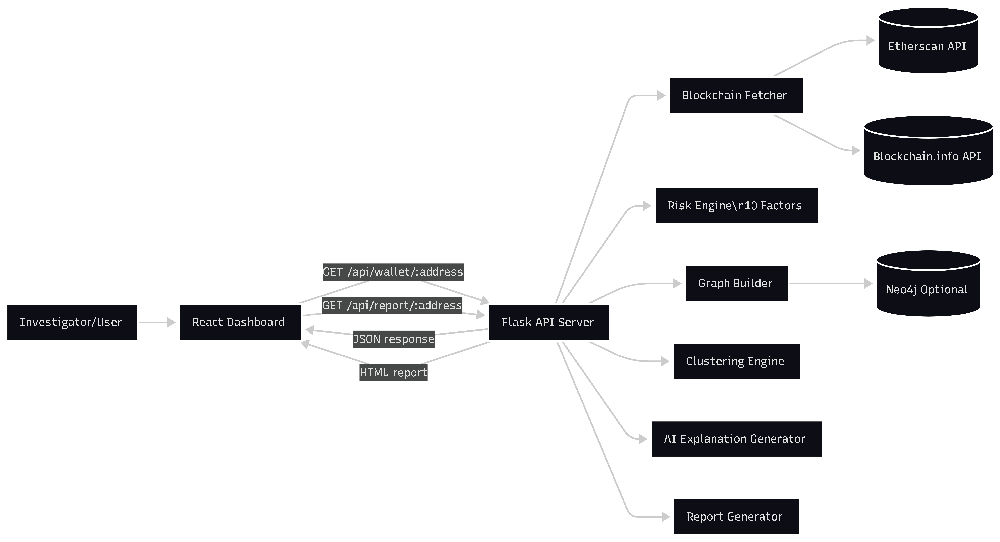
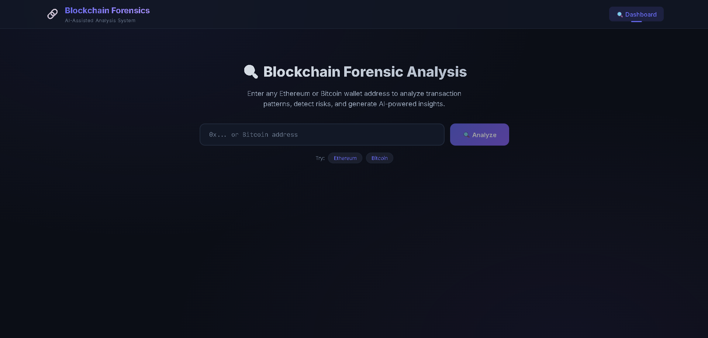
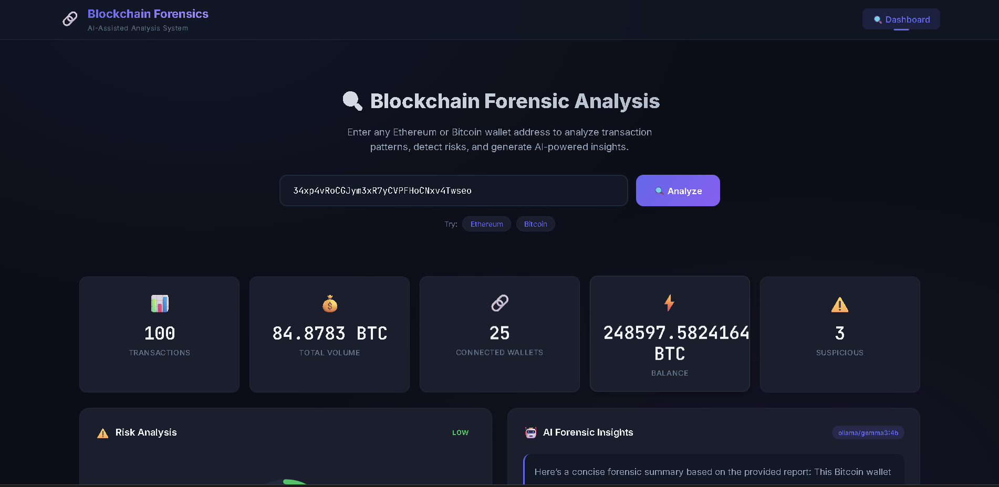
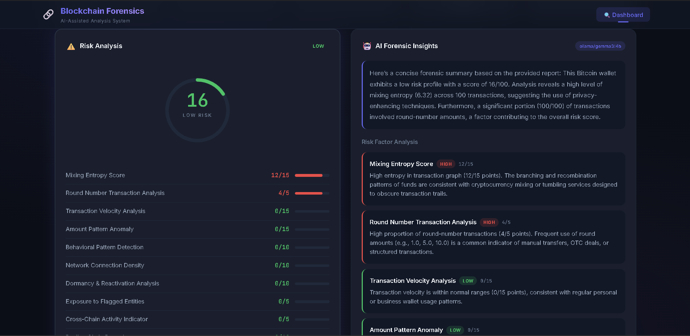
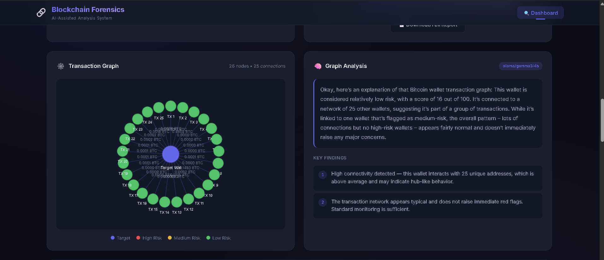
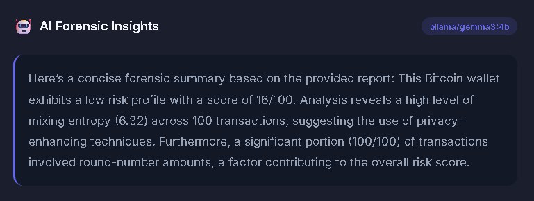
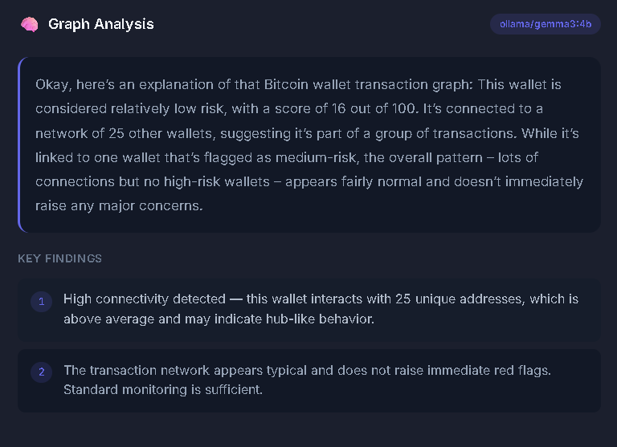
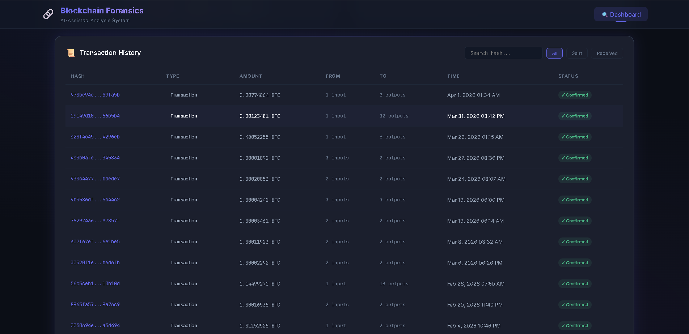

# 🔗 AI-Assisted Blockchain Forensics System

> An intelligent blockchain analysis platform that detects suspicious wallet activity, scores risk using forensic heuristics, and generates AI-powered natural language explanations — built with Python, Flask, React, and Neo4j.


---

## 📋 Table of Contents

- [Overview](#overview)
- [Features](#features)
- [Architecture](#architecture)
- [Tech Stack](#tech-stack)
- [Project Structure](#project-structure)
- [Getting Started](#getting-started)
- [API Endpoints](#api-endpoints)
- [Modules](#modules)
- [Screenshots](#screenshots)
- [Team](#team)

---

## Overview

The **AI-Assisted Blockchain Forensics System** is a full-stack application designed for analyzing cryptocurrency wallet addresses. It fetches real blockchain data from Ethereum and Bitcoin networks, constructs transaction graphs, applies clustering algorithms, calculates risk scores based on 10 forensic factors, and generates human-readable AI explanations — all presented through an interactive dark-mode dashboard.

This project was developed as a **Final Year Project** to demonstrate the application of artificial intelligence and graph analytics in blockchain forensic investigation.

---

## Features

### 🔍 Wallet Analysis
- Automatic detection of Ethereum and Bitcoin addresses
- Real-time data fetching from Etherscan and Blockchain.info APIs
- Transaction history retrieval and volume calculation

### 📊 Graph Analytics
- Neo4j-powered transaction graph construction
- Multi-hop wallet relationship mapping
- Interactive Canvas-based graph visualization with hover tooltips

### ⚠️ Risk Scoring Engine
- **10 forensic risk factors** scored individually:
  - Transaction Velocity | Amount Anomaly | Behavioral Pattern
  - Connection Density | Dormancy Risk | Mixing Entropy
  - Exposure Risk | Chain Hopping | Peeling Chain | Round Number Risk
- Composite risk score (0–100) with risk bands: LOW / MEDIUM / HIGH / CRITICAL

### 🤖 AI Explanation Generator
- Rule-based NLP engine producing natural language summaries
- Per-factor detailed explanations with severity ratings
- Actionable forensic recommendations
- Local Ollama LLM integration (Gemma 3 4B) for AI-enhanced summaries
- Automatic fallback to rule-based engine when Ollama is unavailable
- Confidence scoring based on data quality

### 🔗 Clustering
- Heuristic clustering (common-input ownership)
- Behavioral clustering (K-Means, DBSCAN)
- Community detection algorithms

### 📄 Report Generation
- Self-contained HTML forensic reports
- Dark-theme styled with risk gauge, stats grid, and factor breakdown
- Print-to-PDF ready via browser

### 🖥️ Premium Dashboard
- Dark-mode glassmorphism UI with Inter typography
- SVG circular risk gauge with animated arc
- Filterable transaction table with type badges
- Responsive layout for desktop and tablet

---

## Architecture




## Tech Stack

| Layer | Technology |
|-------|-----------|
| **Frontend** | React 18, Vite 6, Vanilla CSS, Canvas API |
| **Backend** | Python 3.10+, Flask, Flask-CORS |
| **Database** | Neo4j 5.x (graph database) |
| **APIs** | Etherscan API, Blockchain.info API |
| **AI** | Rule-based NLP, Ollama + Gemma 3 4B (local LLM) |
| **ML** | scikit-learn (K-Means, DBSCAN clustering) |

---

## Project Structure

```
Final year project/
├── backend/
│   ├── api_server.py              # Flask REST API (main entry)
│   ├── requirements.txt           # Python dependencies
│   ├── .env                       # Environment variables (API keys)
│   ├── docker-compose.yml         # Neo4j database setup
│   └── src/
│       └── modules/
│           ├── blockchain/        # Module A: Data fetching (Etherscan, Blockchain.info)
│           ├── graph/             # Module B: Neo4j graph builder
│           ├── clustering/        # Module C: Wallet clustering algorithms
│           ├── risk/              # Module D: 10-factor risk scoring engine
│           ├── ai/                # Module E: AI explanation generator
│           ├── report/            # Module G: HTML report generator
│           └── integration/       # Module H: Module integration layer
├── frontend/
│   ├── package.json
│   ├── vite.config.js
│   ├── index.html
│   └── src/
│       ├── main.jsx
│       ├── App.jsx                # Main application + mock data fallback
│       ├── index.css              # Design system (dark mode, glassmorphism)
│       ├── services/
│       │   └── api.js             # API client
│       └── components/
│           ├── Header.jsx         # Navigation bar
│           ├── WalletInput.jsx    # Address input + validation
│           ├── StatsOverview.jsx  # 5 metric cards
│           ├── RiskAnalysis.jsx   # SVG risk gauge + factor bars
│           ├── TransactionGraph.jsx # Canvas graph visualization
│           ├── TransactionList.jsx  # Filterable transaction table
│           └── AIInsights.jsx     # AI summary + recommendations
└── README.md
```

---

## Getting Started

### Prerequisites

- **Python 3.10+** — [Download](https://www.python.org/downloads/)
- **Node.js 18+** — [Download](https://nodejs.org/)
- **Ollama** (optional, for AI-enhanced summaries) — [Download](https://ollama.com/download)
- **Neo4j** (optional) — via Docker or [Neo4j Desktop](https://neo4j.com/download/)

### 1. Clone / Navigate to the project

```bash
cd "Final year project"
```

### 2. Set up environment variables

Edit `backend/.env` with your API keys:

```env
ETHERSCAN_API_KEY=your_etherscan_key
NEO4J_URI=bolt://localhost:7687
NEO4J_USER=neo4j
NEO4J_PASSWORD=your_password

# Ollama (Optional — for AI-enhanced summaries)
OLLAMA_URL=http://127.0.0.1:11434
OLLAMA_MODEL=gemma3:4b
```

> Get a free Etherscan API key at [etherscan.io/apis](https://etherscan.io/apis)

### 3. Set up Ollama (optional — for AI-enhanced summaries)

Install Ollama from [ollama.com/download](https://ollama.com/download), then pull the model:

```bash
ollama pull gemma3:4b
```

Start the Ollama server (runs on `http://127.0.0.1:11434` by default):

```bash
ollama serve
```

> The system works without Ollama — it falls back to a built-in rule-based NLP engine that requires no external dependencies.

### 4. Start Neo4j (optional)

```bash
cd backend
docker-compose up -d
```

> The system works without Neo4j — graph data is built from raw blockchain transactions as a fallback.

### 5. Start the backend

```bash
cd backend
pip install -r requirements.txt
python api_server.py
```

The API server starts at **http://localhost:5000**.

### 6. Start the frontend

```bash
cd frontend
npm install
npm run dev
```

The dashboard opens at **http://localhost:5173**.

### 7. Analyze a wallet

Enter any Ethereum or Bitcoin address in the search box, or try one of the sample addresses:
- **Binance Hot Wallet**: `0xF977814e90dA44bFA03b6295A0616a897441aceC`
- **Vitalik Buterin**: `0xd8dA6BF26964aF9D7eEd9e03E53415D37aA96045`

> 💡 The frontend works in **demo mode** with mock data even without the backend running.

---

## API Endpoints

| Method | Endpoint | Description |
|--------|----------|-------------|
| `GET` | `/api/health` | Health check with module status |
| `GET` | `/api/wallet/<address>` | Full forensic analysis |
| `GET` | `/api/report/<address>` | Download HTML forensic report |

### Sample Response — `/api/wallet/<address>`

```json
{
  "address": "0xF977814e...",
  "blockchain": "ethereum",
  "riskScore": 72,
  "riskLevel": "HIGH",
  "totalTransactions": 156,
  "totalVolume": "45.67 ETH",
  "balance": "1234.5678 ETH",
  "connectedWallets": 45,
  "transactions": [...],
  "graphData": { "nodes": [...], "edges": [...] },
  "aiInsights": {
    "summary": "This Ethereum wallet exhibits multiple high-risk...",
    "riskFactors": [...],
    "recommendations": [...],
    "confidence": 85,
    "ai_model": "rule-based"
  }
}
```

---

## Modules

### Module A — Blockchain Data Fetcher
Fetches wallet data from **Etherscan** (Ethereum) and **Blockchain.info** (Bitcoin). Supports automatic blockchain detection based on address format.

### Module B — Graph Builder
Stores wallet-to-wallet relationships in **Neo4j** graph database. Maps transaction flows for multi-hop analysis.

### Module C — Clustering Engine
Groups related wallets using:
- **Heuristic clustering** — common-input-ownership heuristic
- **Behavioral clustering** — K-Means and DBSCAN on transaction features
- **Community detection** — graph-based community algorithms

### Module D — Risk Scoring Engine
Calculates a **composite risk score (0–100)** from 10 weighted forensic factors. Each factor is independently scored and explained.

### Module E — AI Explanation Generator
Converts raw risk metrics into **natural language explanations**:
- Severity-aware summary paragraphs
- Per-factor detailed analysis cards
- Actionable forensic recommendations
- Optionally enhances summaries with local **Ollama LLM** (Gemma 3 4B)
- Falls back to rule-based NLP when Ollama is unavailable

### Module G — Report Generator
Produces **self-contained HTML reports** with dark theme styling, risk gauge, statistics grid, factor breakdown, and transaction table. Printable to PDF.

### Module H — Integration Layer
Orchestrates data flow between modules: fetch → graph → cluster → risk → AI → report.

---


## Screenshots

Application snapshots are available in `docs/snapshots/` (guidelines: [docs/snapshots/README.md](docs/snapshots/README.md)).

| Screen | Preview |
|--------|---------|
| Home Dashboard |  |
| Wallet Analysis Result |  |
| Risk Breakdown |  |
| Transaction Graph |  |
| AI Insights (1) |  |
| AI Insights (2) |  |
| Transaction History |  |

---

## Team

| Member | Role | Modules |
|--------|------|---------|
| **Mohit & krusha** | Backend & Integration | API Server, Integration Layer, Frontend |
| **Shreya** | AI & Analysis | AI Explanation Generator, Risk Engine |
| **Isha & Shreya** | Blockchain Data Fetcher | API integration, error handling, data validation |
| **Shubham** | Reports & Clustering | Report Generator, Clustering |
| **Mohit & Krusha** | Frontend & Data | Dashboard UI, Blockchain Fetcher |

---

## License

This project is developed for **academic and research purposes only** as a Final Year Project. Not intended for production use.

---

<p align="center">
  <strong>AI-Assisted Blockchain Forensics System</strong><br>
  Built with 🔗 by the team
</p>
